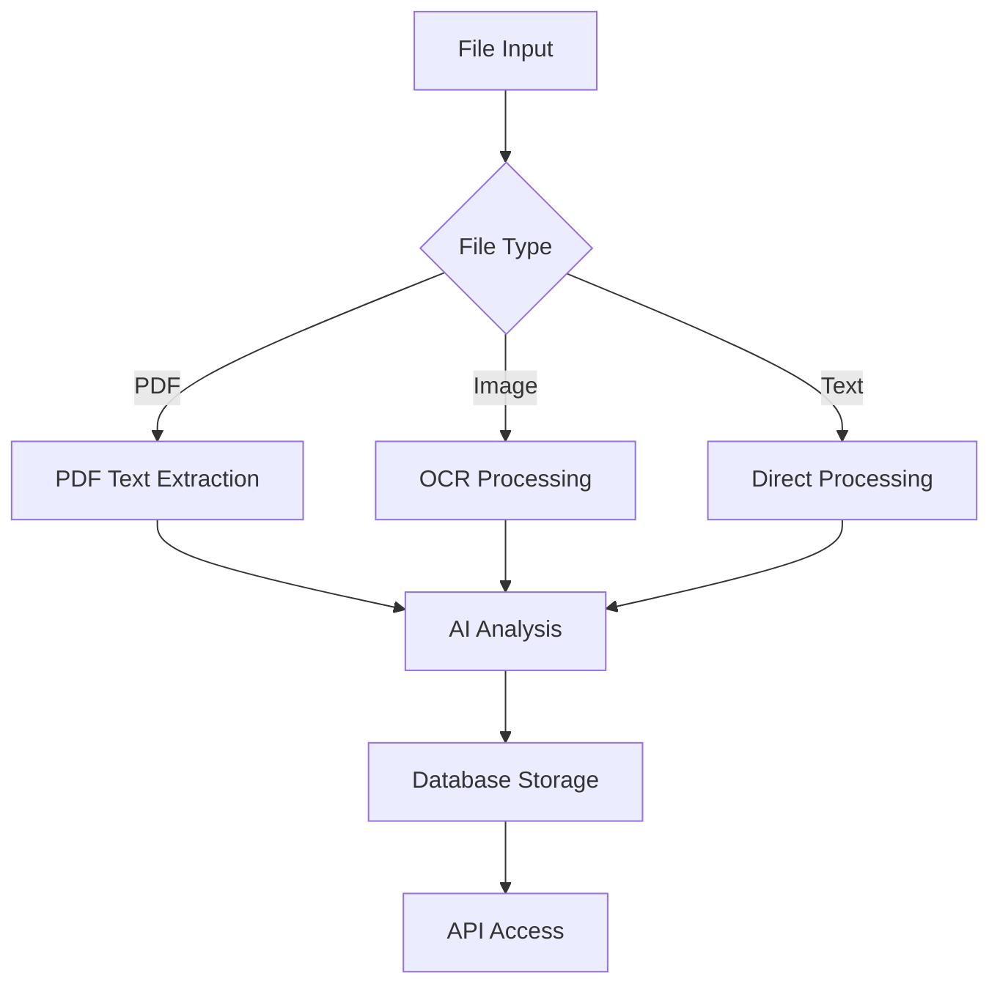

# AI-Powered Legal Document Processing System

## Overview
This system provides automated processing and analysis of legal documents using advanced AI techniques. It supports multiple file formats including PDF, text, and images (JPG/PNG) through OCR capabilities.

## Key Features
- **Multi-Format Support**: Process TXT, PDF, and image files
- **AI Analysis**:
  - Document summarization
  - Entity recognition (cases, parties, legal terms)
  - Question answering over documents
- **Database Integration**: Stores metadata and analysis results
- **OCR Processing**: Text extraction from scanned documents/images
- **Validation**: File type verification and content hashing
- **Backup Feature**: Creates copies of files before modifications to prevent data loss.
- **Code Health Checks**: Integrates linting and formatting tools to ensure code quality.

## System Architecture



Main Components:
- **LegalAIProcessor**: Core document processing logic
- **AIMediaProcessor**: Handles AI model interactions
- **LegalDataSource**: Manages legal terminology and APIs
- **Database Models**: 
  - FileMetadata
  - CacheEntry
  - User

## Installation

```bash
# Clone repository
git clone https://github.com/your-org/legal-ai-processor.git
cd legal-ai-processor

# Install dependencies
pip install -r requirements-ai.txt
python -m spacy download en_core_web_sm

# Install Tesseract OCR (Windows)
choco install tesseract
```

## Configuration
Set up your environment in `config_ai.py`:
```python
AI_CONFIG = {
    "legal_sources": {
        "api_key": "your_api_key",
        "terms_db": "legal_terms.json"
    },
    "ai_models": {
        "summarizer": "facebook/bart-large-cnn",
        "ner": "dslim/bert-base-NER"
    }
}
```

## Usage Example

```python
from legal_ai_processor import LegalAIProcessor
from config_ai import get_config

processor = LegalAIProcessor(get_config())
result = processor.process
